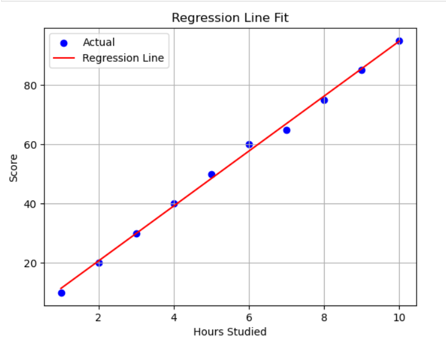

# 📊 Student Score Predictor – Linear Regression

This is a simple machine learning project using **Linear Regression** to predict student scores based on the number of hours they studied.

---

## 📁 Dataset
The dataset contains:
- **Hours** studied
- **Scores** achieved

CSV file used: `hours_scores.csv`

---

## 🚀 Technologies Used
- Python
- Pandas
- NumPy
- Matplotlib
- Scikit-learn

---

## 🔍 Project Flow

1. **Data Loading** – Load dataset from CSV  
2. **Data Visualization** – Plot scatter graph of Hours vs Scores  
3. **Data Preprocessing** – Splitting data into training and testing sets  
4. **Model Training** – Fit Linear Regression model  
5. **Prediction** – Predict test data scores  
6. **Visualization** – Plot regression line  
7. **Evaluation** – Evaluate model using MAE, MSE, and R² Score

---

## 📈 Result Sample

| Actual Score | Predicted Score |
|--------------|-----------------|
| 88           | 85.2            |
| 60           | 58.7            |

---

## 🧠 Learnings
- Basics of supervised machine learning
- Implementing Linear Regression with Scikit-learn
- Model evaluation using common metrics
- Visualizing data and regression line with Matplotlib

---

## 🗃️ Output Visualization



---

## 📦 How to Run

1. Clone the repo:
```bash
git clone https://github.com/your-username/student-score-predictor.git

